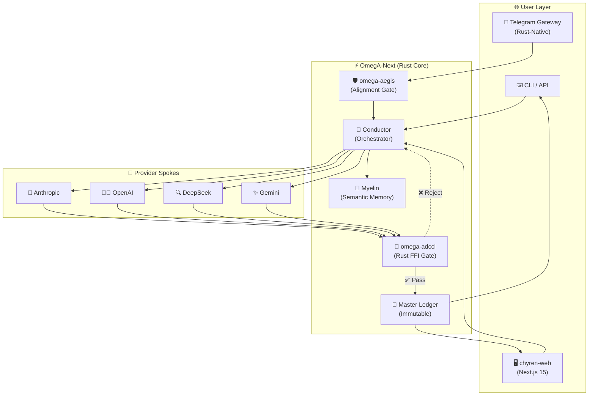

<div align="center">

<div align="center">

[](https://github.com/Mega-Therion/Chyren/blob/main/LICENSE)
[](https://www.rust-lang.org)
[](https://www.python.org)
[](https://github.com/Mega-Therion/Chyren/stargazers)
[](https://github.com/Mega-Therion/Chyren/network/members)

[](https://github.com/Mega-Therion/Chyren)  
[](https://github.com/Mega-Therion/Chyren)  
[](https://github.com/Mega-Therion/Chyren)  
[](https://github.com/Mega-Therion/Chyren)  
[](https://github.com/Mega-Therion/Chyren)

</div>

```text
  ██████╗██╗  ██╗██╗   ██╗██████╗ ███████╗███╗   ██╗
  ██╔════╝██║  ██║╚██╗ ██╔╝██╔══██╗██╔════╝████╗  ██║
  ██║     ███████║ ╚████╔╝ ██████╔╝█████╗  ██╔██╗ ██║
  ██║     ██╔══██║  ╚██╔╝  ██╔══██╗██╔══╝  ██║╚██╗██║
  ╚██████╗██║  ██║   ██║   ██║  ██║███████╗██║ ╚████║
   ╚═════╝╚═╝  ╚═╝   ╚═╝   ╚═╝  ╚═╝╚══════╝╚═╝  ╚═══╝
```

# Ω CHYREN

### Sovereign Intelligence Orchestrator

[](https://github.com/Mega-Therion/Chyren/actions)
[](https://chyren-web.vercel.app/)
[](https://github.com/Mega-Therion/Chyren/blob/main/LICENSE)
[](https://python.org/)
[](https://rust-lang.org/)

**Routes intelligence. Verifies truth. Remembers everything.**

[Live Demo](https://chyren-web.vercel.app/) • [Documentation](https://github.com/Mega-Therion/Chyren/blob/main/CLAUDE.md) • [Architecture](#architecture)

</div>

---

## 🔮 What is Chyren?

Chyren is a **stateful sovereign AI orchestrator** — a high-integrity execution platform designed for the next generation of cognitive architecture. 

**Chyren v2.1.0 (OmegA-Next)** features:
- ⚡ **Native Rust Performance**: Core integrity gates (`ADCCL`, `Aegis`, `Sandbox`) migrated to Rust binaries.
- 🛡️ **FFI-Bridge**: Legacy Python Orchestrator linked to Rust via high-performance C-FFI.
- 💬 **Sovereign Mesh**: Telegram-native gateway for secure, audited remote access.
- 🔐 **Cryptographic Integrity**: Every transaction signed with the Yettragrammaton (HMAC-SHA256).
- 🧬 **Identity Kernel**: Self-synthesizing identity foundations (58,000+ entries).

---

## 🏗️ Architecture: The Sovereign Stack



---

## 🚀 Deployment

1. **Environment:** Setup `~/.omega/one-true.env` with provider API keys.
2. **Build:** `./scripts/docker-manager.sh build`
3. **Deploy:** `./scripts/docker-manager.sh up -d`
4. **Interface:** Access `http://localhost:3000` or interact with your `@Chyren_Sovereign_Bot` on Telegram.

---

## 🔑 Security & Integrity

Every component in Chyren is cryptographically bound to the **Yettragrammaton** — a root integrity hash that ensures:
- No component can operate outside the constitutional framework.
- All ledger entries are signed and tamper-proof.
- Identity synthesis is verifiable and reproducible.

---

## 📜 License

Proprietary. See [LICENSE](LICENSE) for details.
