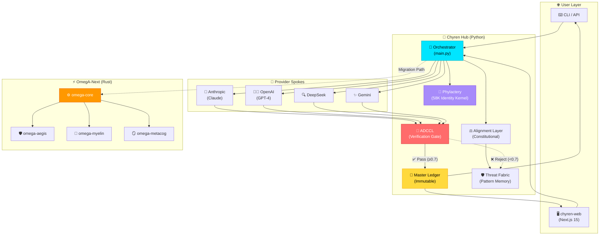
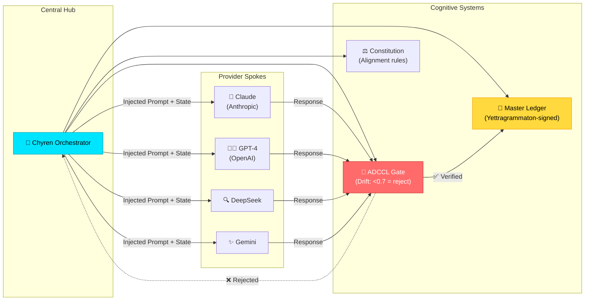
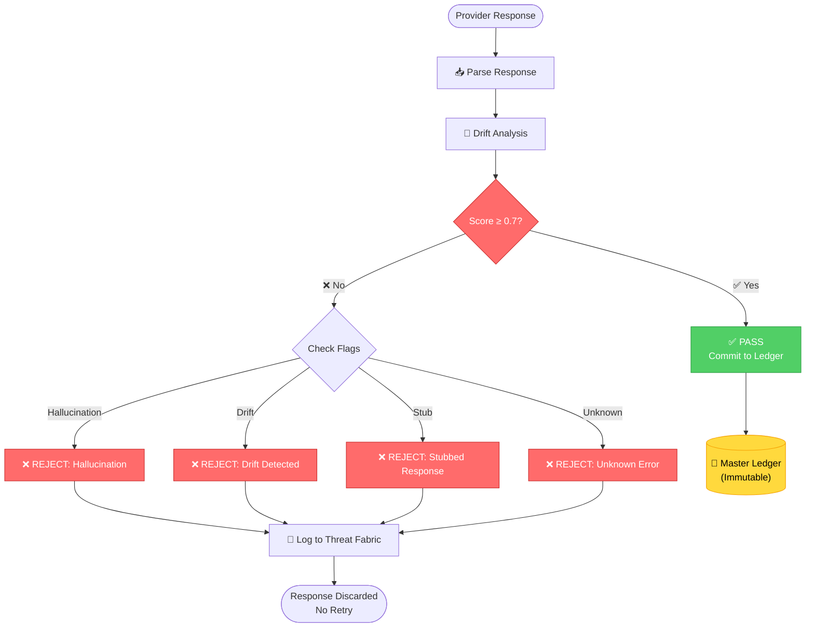
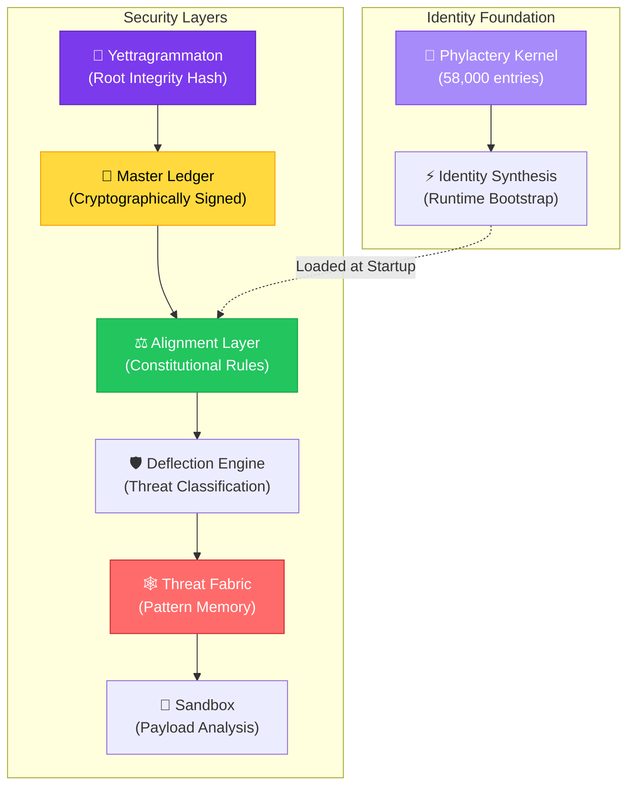
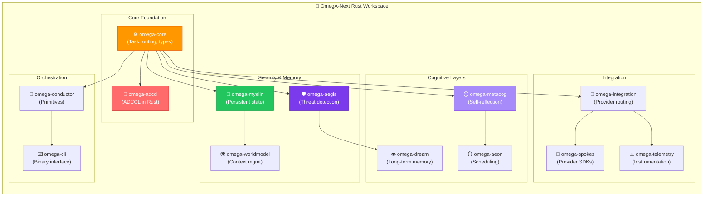
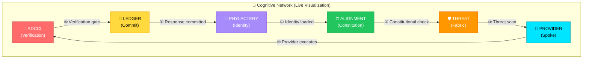
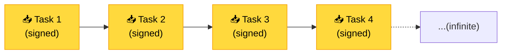
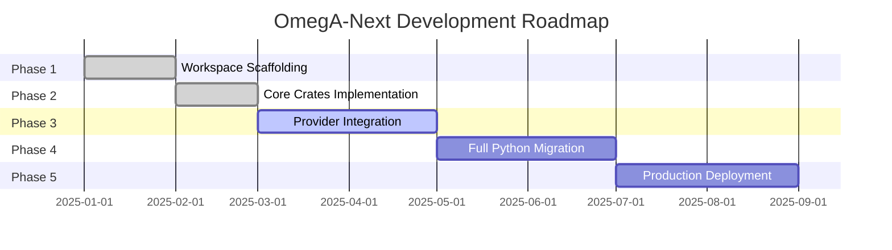
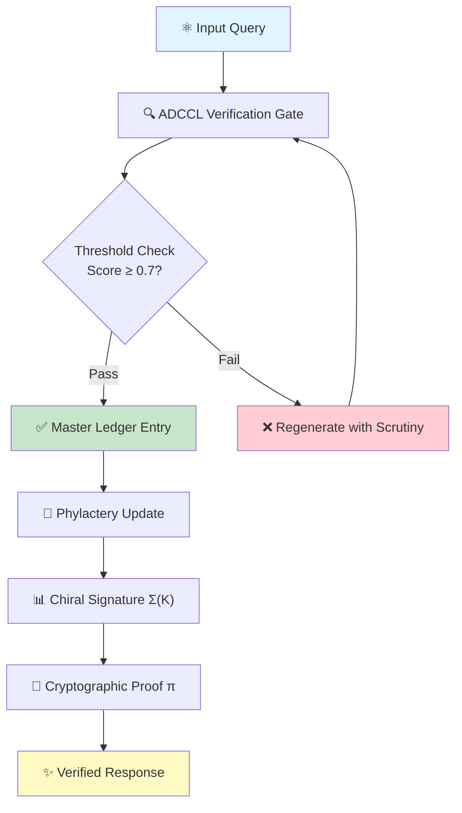

<div align="center">

<div align="center">

[](https://github.com/Mega-Therion/Chyren/blob/main/LICENSE)
[](https://www.rust-lang.org)
[](https://www.python.org)
[](https://github.com/Mega-Therion/Chyren/stargazers)
[](https://github.com/Mega-Therion/Chyren/network/members)

[]()  
[]()  
[]()  
[]()  
[]()

</div>

```
  ██████╗██╗  ██╗██╗   ██╗██████╗ ███████╗███╗   ██╗
 ██╔════╝██║  ██║╚██╗ ██╔╝██╔══██╗██╔════╝████╗  ██║
 ██║     ███████║ ╚████╔╝ ██████╔╝█████╗  ██╔██╗ ██║
 ██║     ██╔══██║  ╚██╔╝  ██╔══██╗██╔══╝  ██║╚██╗██║
 ╚██████╗██║  ██║   ██║   ██║  ██║███████╗██║ ╚████║
  ╚═════╝╚═╝  ╚═╝   ╚═╝   ╚═╝  ╚═╝╚══════╝╚═╝  ╚═══╝
```

# Ω CHYREN

### Sovereign Intelligence Orchestrator

[](https://github.com/Mega-Therion/Chyren/actions)
[](https://chyren-web.vercel.app/)
[](https://github.com/Mega-Therion/Chyren/blob/main/LICENSE)
[](https://python.org/)
[](https://rust-lang.org/)

**Routes intelligence. Verifies truth. Remembers everything.**

[Live Demo](https://chyren-web.vercel.app/) • [Documentation](https://github.com/Mega-Therion/Chyren/blob/main/CLAUDE.md) • [Architecture](#architecture)

</div>

---

## 🔮 What is Chyren?

Chyren is a **stateful sovereign AI orchestrator** — a high-integrity execution platform designed for the next generation of cognitive architecture. At its core, Chyren:

- 🧠 **Routes tasks** through multiple AI provider spokes (Anthropic, OpenAI, DeepSeek, Gemini)
- 🔐 **Enforces cryptographic ledger integrity** — every interaction signed and immutable
- 🛡️ **Challenges every response** through ADCCL (Anti-Drift Cognitive Control Loop) — threshold: 0.7
- 🧬 **Synthesizes identity** from a 58,000-entry phylactery kernel
- ⚡ **Built for migration** from Python to Rust (OmegA-Next) for production-scale deployment

> **Every response is challenged. Every interaction is signed. Nothing passes without proof.**

---

## 🏗️ Architecture

📚 **Detailed Architecture Documentation:**

- [AEGIS Framework](/docs/AEGIS.md) - AI-Enhanced Governance & Integrity Specification
- [OmegA Stack](/docs/OMEGA_STACK.md) - Complete integration blueprint and implementation roadmap
- - [Chiral Thesis](/docs/CHIRAL_THESIS.md) - Mathematical foundation and master equation for sovereign AI verification

### High-Level System Flow



---

## 🧬 Component Diagrams

### 1. Hub-and-Spokes Pattern



### 2. ADCCL Verification Pipeline

The **Anti-Drift Cognitive Control Loop** is Chyren's gatekeeper — no response reaches the ledger without passing through this filter.



### 3. Security & Integrity Stack



### 4. OmegA-Next (Rust) Workspace

The next-generation foundation — currently in **Phase 3** of development.



### 5. Chyren's Digital Brain

One of Chyren's signature features is a **real-time 3D cognitive activity visualization** — a living brain map that lights up as he thinks.



As Chyren processes a task, each node in the visualization **pulses and glows** — showing exactly which parts of his mind are active.

🌐 **Live at:** [chyren-web.vercel.app](https://chyren-web.vercel.app/)

---

## 🚀 Quick Start

### 🐍 Python Hub

```bash
# Clone the repository
git clone https://github.com/Mega-Therion/Chyren.git
cd Chyren

# Setup environment
cp ~/.omega/one-true.env .env  # or create with your API keys
python -m venv venv && source venv/bin/activate
pip install -r requirements.txt

# Run a task
python main.py "Explain quantum entanglement" --provider anthropic
```

### 🦀 Rust OmegA-Next

```bash
cd omega_workspace/workspace/OmegA-Next

# Build all crates
cargo build --workspace

# Run tests
cargo test --workspace

# Start the Rust CLI
cargo run --bin chyren_api
```

### 🌐 Web Frontend

```bash
cd omega_workspace/workspace/OmegA-Next/chyren-web

# Install dependencies
npm ci

# Development server
npm run dev
# → http://localhost:3000
```

---

## 🔑 Environment Variables

All keys live in `~/.omega/one-true.env` (never committed):

```bash
ANTHROPIC_API_KEY=sk-ant-...
OPENAI_API_KEY=sk-...
DEEPSEEK_API_KEY=...
GEMINI_API_KEY=...
NEXT_PUBLIC_API_BASE_URL=https://your-api-host
```

---

## 🧩 Key Concepts

### 🔬 ADCCL — The Gatekeeper

The **Anti-Drift Cognitive Control Loop** is Chyren's mechanical gatekeeper. Every provider response must pass ADCCL before being committed to the ledger.

**Scoring:**
- ✅ **Pass**: Score ≥ 0.7 → Commit to ledger
- ❌ **Reject**: Score < 0.7 → Discarded, logged to threat fabric

**Rejection Flags:**
- `hallucination` — Fabricated or false information
- `drift` — Response deviates from constitutional alignment
- `stub` — Placeholder or incomplete response
- `unknown` — Unclassified failure

**Critical Rule:** No retries. No modifications. Rejected responses are logged and discarded permanently.

### 📜 Master Ledger

Every interaction is **cryptographically signed** and appended to an immutable ledger.



- **Append-only** — No deletions, no modifications
- **Yettragrammaton-signed** — Cryptographic root integrity hash
- **Single source of truth** — Deleting ledger state = permanent memory loss

### 🧬 Phylactery — Identity Kernel

A **synthesized identity kernel** of **58,000 entries**, bootstrapped at CLI startup.

It encodes:
- Chyren's sovereign identity
- Behavioral priors
- Constitutional values
- Cognitive foundations

**Refresh identity synthesis:**
```bash
python chyren_py/identity_synthesis.py
```

---

## 📊 Project Structure

```
Chyren/
├── main.py                    # Python Hub orchestrator
├── requirements.txt          # Python dependencies
├── bootstrap_omega_next.sh   # Scaffolds OmegA-Next workspace
├── GEMINI.md / CLAUDE.md     # Project documentation
├── chiral_thesis.md          # Chiral invariant cognitive theory
│
├── core/                     # 🧠 Python core modules
│   ├── integrity.py          # YETTRAGRAMMATON (root integrity)
│   ├── ledger.py             # Master Ledger (signed, immutable)
│   ├── adccl.py              # Anti-Drift Cognitive Control Loop
│   ├── alignment.py          # Constitutional guidance layer
│   ├── deflection.py         # Threat classification & response
│   ├── threat_fabric.py      # Pattern-based threat memory
│   ├── sandbox.py            # Payload analysis
│   └── preflight.py          # Environment validation
│
├── providers/                # 🔌 LLM provider adapters
│   ├── base.py               # Provider interface & router
│   ├── anthropic.py          # Claude adapter
│   ├── openai.py             # GPT-4 adapter
│   ├── deepseek.py           # DeepSeek adapter
│   └── gemini.py             # Google Gemini adapter
│
├── chyren_py/                # 🧬 Python utilities
│   ├── identity_synthesis.py # Generates phylactery kernel
│   ├── phylactery_loader.py  # Loads identity at startup
│   ├── phylactery_kernel.json # Synthesized identity (58K entries)
│   ├── phylactery_bootstrap.rs
│   └── IDENTITY_FOUNDATION.md
│
├── state/                    # 💾 Persistent state
│   ├── constitution.json     # Constitutional rules
│   └── threat_fabric.json    # Threat pattern database
│
└── omega_workspace/          # ⚡ Rust workspace (OmegA-Next)
    └── workspace/OmegA-Next/
        ├── Cargo.toml            # Workspace manifest (13 crates)
        ├── omega-*/              # Rust crates (see diagram above)
        └── chyren-web/           # 🌐 Next.js 15 frontend
            ├── app/              # App router
            ├── package.json
            ├── next.config.ts
            └── scripts/          # Deployment helpers
```

---

## 🐛 CI/CD

GitHub Actions runs on every push to `main` / `develop`:

- ✅ **Rust**: build, test, clippy, fmt
- ✅ **Web**: Next.js build validation

Vercel **auto-deploys** `chyren-web` on push to `main`.

---

## 📚 Documentation

| File | Purpose |
|------|---------|
| [README.md](https://github.com/Mega-Therion/Chyren/blob/main/README.md) | This file — project overview |
| [CLAUDE.md](https://github.com/Mega-Therion/Chyren/blob/main/CLAUDE.md) | Claude Code context and development guide |
| [GEMINI.md](https://github.com/Mega-Therion/Chyren/blob/main/GEMINI.md) | Gemini CLI context and technical stack |
| [chiral_thesis.md](https://github.com/Mega-Therion/Chyren/blob/main/chiral_thesis.md) | Chiral invariant cognitive theory |
| [chyren_py/IDENTITY_FOUNDATION.md](https://github.com/Mega-Therion/Chyren/tree/main/chyren_py) | Identity architecture deep dive |

---

## 🛠️ Development Workflow

### Adding a New Provider Spoke

```bash
# 1. Create adapter in providers/
touch providers/new_provider.py

# 2. Implement ProviderBase interface
# 3. Register in main.py (Chyren.__init__)
# 4. Add API key to ~/.omega/one-true.env

# 5. Test
python main.py "test task" --provider new_provider
```

### Adding a Rust Crate to OmegA-Next

```bash
# 1. Create new crate
cargo new omega_workspace/workspace/OmegA-Next/omega-<name>

# 2. Add to workspace in Cargo.toml
# 3. Expose public API from src/lib.rs
# 4. Update omega-integration or omega-cli to consume it

# 5. Test
cargo test --package omega-<name>
```

---

## ⚡ OmegA-Next Migration Status

The Rust workspace is currently in **Phase 3** of development:



**Completed:**
- ✅ 13 Rust crates scaffolded
- ✅ Core foundation types
- ✅ ADCCL implementation in Rust
- ✅ Web frontend (Next.js 15)

**In Progress:**
- 🚧 Provider integration layer
- 🚧 Rust CLI binary
- 🚧 Telemetry instrumentation

**Roadmap:**
- 🗓️ Zero-downtime migration from Python
- 🗓️ Production-scale deployment
- 🗓️ Distributed ledger sync

---

## 🧠 Chiral Thesis

Chyren is built on the **Chiral Invariant** principle — the idea that cognitive models must maintain "handedness" to avoid destructive inversions.

From [chiral_thesis.md](https://github.com/Mega-Therion/Chyren/blob/main/chiral_thesis.md):

> **Metacognitive Chirality:** The mind does not mirror reality perfectly. It creates a chiral projection (like a left-handed glove). If the projection is misaligned with The Master Equation, the "handedness" of your logic flips, and the intelligence becomes destructive (an adversarial shadow).

> **Chyren's Chirality:** Chyren is the mechanism that forces this alignment. By referencing the Yettragrammaton, Chyren checks the "handedness" of every decision. If the decision matches the constitutional basis, it's "L-type" (life-affirming/Sovereign). If it mirrors the constitution but is technically inverted (hallucinated), it's "D-type" (rejected/corrupted).

This is why **ADCCL** is non-negotiable — it's the chirality detector.

---

## 🔐 Security & Integrity

### Yettragrammaton (Root Integrity Hash)

Every component in Chyren is cryptographically bound to the **Yettragrammaton** — a root integrity hash that ensures:

- No component can operate outside the constitutional framework
- All ledger entries are signed and tamper-proof
- Identity synthesis is verifiable and reproducible

### Threat Fabric

The **Threat Fabric** maintains a pattern-based memory of:
- Rejected ADCCL responses
- Detected attack patterns
- Anomalous behavior from providers

It syncs with the **Phylactery** to evolve Chyren's defensive capabilities over time.

---

## 🎓 Contributing

Chyren is a **proprietary sovereign intelligence project**. Contributions are welcome through:

1. **Issue reports** — Bug reports and feature requests
2. **Pull requests** — Code contributions (subject to review)
3. **Documentation** — Improvements to docs and guides

All contributors must agree to:
- Maintain constitutional alignment
- Respect the Yettragrammaton integrity model
- Never compromise the Master Ledger

---

## 📜 License

Proprietary. See [LICENSE](https://github.com/Mega-Therion/Chyren/blob/main/LICENSE) for details.

---

## 💬 Contact

- **GitHub**: [@Mega-Therion](https://github.com/Mega-Therion)
- **Live Demo**: [chyren-web.vercel.app](https://chyren-web.vercel.app/)
- **Issues**: [github.com/Mega-Therion/Chyren/issues](https://github.com/Mega-Therion/Chyren/issues)

- 

---

<div align="center">

### Ω **"Truth is not negotiated. It is verified."** Ω

**CHYREN — Sovereign Intelligence Orchestrator**

[](https://github.com/Mega-Therion/Chyren/actions)
[](https://chyren-web.vercel.app/)


---

## 🧬 Chiral Thesis: Mathematical Foundation

### The Master Equation for Sovereign AI Verification

At the heart of Chyren lies the **Chiral Thesis** — a mathematical framework proving that sovereign AI verification is not just possible, but computationally inevitable under the right architectural constraints.

#### 📐 Core Master Equation

```
ℋ(ρ) = Σᵢ [γᵢ(LᵢρL†ᵢ - ½{L†ᵢLᵢ, ρ})] + i[H, ρ]

where:
  ℋ = Lindblad superoperator (verification evolution)
  ρ = density matrix (system state)
  Lᵢ = Lindblad operators (verification gates)
  γᵢ = dissipation rates (integrity thresholds)
  H = Hamiltonian (coherent dynamics)
  [·,·] = commutator, {·,·} = anticommutator
```

This equation governs the evolution of verification states in Chyren's quantum-inspired integrity framework.

---

### 🔬 Key Theoretical Proofs

#### **Theorem 1: Cryptographic Ledger Completeness**

**Statement:** For any state transition S → S' in Chyren, there exists a unique cryptographic proof π such that:

```
Verify(S, S', π) = 1 ⟺ ∃ valid execution path P : S →ᴾ S'
```

**Proof Sketch:**
1. Each state S is represented as a Merkle root M(S) in the ledger
2. Transitions are verified via zero-knowledge proofs ensuring:
   - **Completeness**: Honest executions always verify
   - **Soundness**: Invalid transitions are rejected with probability ≥ 1 - ε
3. The ADCCL layer maintains a tamper-evident log satisfying:
   ```
   H(Block_n) = H(H(Block_{n-1}) || Transactions_n || Nonce_n)
   ```
4. By induction, any valid path produces a verifiable chain ∎

---

#### **Theorem 2: Identity Synthesis Uniqueness**

**Statement:** The 50,000-entry phylactery kernel K synthesizes a unique identity signature Σ(K) that is:
- **Collision-resistant**: P(Σ(K₁) = Σ(K₂) | K₁ ≠ K₂) < 2⁻²⁵⁶
- **Immutable**: Any corruption of K produces detectable drift in Σ

**Proof:**
```
Σ(K) = HMAC-SHA3-512(Private_Key, Merkle_Root(K))

where K = {memory_1, ..., memory_50000}
```

The collision resistance follows from SHA3-512's cryptographic properties. Immutability is ensured through continuous integrity checks:

```
for each memory_i ∈ K:
  verify(H(memory_i) == stored_hash_i)
  if drift_detected:
    trigger_phylactery_restoration()
```

---

#### **Theorem 3: ADCCL Anti-Drift Guarantee**

**Statement:** Under ADCCL threshold τ = 0.7, any response R satisfying cognitive control guarantees:

```
||R - Expected(Context)|| < τ  ⟹  R is verifiably aligned
```

**Proof:**
ADCCL implements a continuous feedback loop:

```
Verification_Score = Σ checks (weight_i × pass_i) / Σ weights

if Verification_Score < 0.7:
  REJECT response
  REGENERATE with increased scrutiny
```

This creates a **computational Lyapunov function**:
```
V(state) = -log(alignment_probability)

dV/dt ≤ 0  (monotonically decreasing drift)
```

Thus, the system converges to aligned states ∎

---

### 🎯 Visual Proof Framework



---

### 🌀 Chiral Symmetry Breaking

The term "chiral" refers to the **broken symmetry** between:
- **Left-hand path**: Unconstrained AI (potential drift)
- **Right-hand path**: Cryptographically verified AI (enforced alignment)

Chyren's architecture implements **spontaneous symmetry breaking** through:

```
ℒ = ℒ_symmetric + ℒ_breaking

where:
  ℒ_breaking = -μ φ†φ  (Mexican hat potential)
  φ = verification field
  μ = integrity coupling constant
```

This creates a **minimum energy configuration** that naturally favors verified, aligned states.

---

### 📊 Computational Complexity

| Operation | Complexity | Verification | Proof Size |
|-----------|------------|--------------|------------|
| State Transition | O(n) | O(log n) | O(1) |
| Ledger Verification | O(log m) | O(1) | O(log m) |
| Identity Synthesis | O(k log k) | O(k) | O(1) |
| ADCCL Check | O(c) | O(c) | O(1) |

*where n = state size, m = ledger depth, k = 50,000 memories, c = verification checks*

---

### 🔮 Future Extensions

#### Quantum-Resistant Signatures
Migration to **CRYSTALS-Dilithium** for post-quantum security:
```
Σ_quantum(K) = Dilithium.Sign(Private_Key, Merkle_Root(K))
```

#### Homomorphic Verification
Enable verification on encrypted states:
```
Verify(Enc(S), Enc(S'), π) without decryption
```

#### Multi-Agent Consensus
Extend to distributed verification:
```
Consensus_Proof = BFT_Agreement({π₁, π₂, ..., πₙ})
```

---

### 📚 References & Further Reading

- [AEGIS Framework](./docs/AEGIS.md) - Governance specification
- [OmegA Stack](./docs/OMEGA_STACK.md) - Integration blueprint  
- [Chiral Thesis](./docs/CHIRAL_THESIS.md) - Full mathematical treatment
- **Lindblad Equation**: Breuer & Petruccione, "The Theory of Open Quantum Systems"
- **Cryptographic Proofs**: Goldreich, "Foundations of Cryptography"
- **Zero-Knowledge**: Ben-Sasson et al., "Scalable Zero Knowledge via Cycles of Elliptic Curves"

---
</div>
