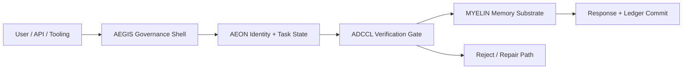

<div align="center">

[](./docs/GOVERNANCE.md)
[](https://www.rust-lang.org/)
[](https://www.python.org/)
[](./web)
[](./gateway)

<picture>
  <source media="(prefers-color-scheme: dark)" srcset="./banner.svg">
  
</picture>

### Sovereign Intelligence Orchestrator
**Route intelligence. Verify claims. Persist identity.**

[Live Demo](https://chyren-web.vercel.app/) • [Quickstart](./docs/QUICKSTART.md) • [Architecture Atlas](./docs/ARCHITECTURE_ATLAS.md) • [Showcase](./docs/SHOWCASE.md) • [Evidence Matrix](./docs/EVIDENCE_MATRIX.md)

</div>

## What Chyren Is
Chyren is a multi-layer system that separates reasoning (`cortex/`) from execution (`medulla/`) and enforces verification before memory writes. It is designed around the OmegA stack: `AEGIS -> AEON -> ADCCL -> MYELIN`.

## Architecture at a Glance


Project map:
- `cortex/` Python orchestration, verification logic, operators.
- `medulla/` Rust workspace (`omega-*`) for runtime, telemetry, integration, and CLI binaries.
- `web/` Next.js app for interactive interface.
- `gateway/` Vite/React gateway surface.
- `docs/` technical references, runbooks, and thesis content.

## Mathematical Core
The central verification concept is the Chiral Invariant:

$$
\chi(\Psi,\Phi)=\operatorname{sgn}(\det[J_{\Psi\to\Phi}])\cdot \|\mathbf{P}_\Phi(\Psi)-\Psi\|_{\mathcal H}
$$

Decision boundary:
- `chi >= 0.7` -> accept (L-type alignment).
- `chi < 0.7` -> reject/repair (D-type drift risk).

For formal derivation and diagrams, see [docs/CHIRAL_THESIS.md](./docs/CHIRAL_THESIS.md).

## Quick Start
```bash
# Rust workspace checks
cd medulla && cargo fmt && cargo clippy -- -D warnings && cargo test

# Web app
cd web && npm install && npm run dev

# Unified CLI entrypoint
./chyren status
```

## Releases (CLI)
Tagged releases (`v*`) publish prebuilt `chyren` binaries for Linux/macOS/Windows under GitHub Releases, with `.sha256` checksums.

## Visuals and Deep Dive
The full architecture + system-design explainer (control-flow diagrams, state machine, math guardrails, novelty matrix, and proof dashboard) lives in [docs/ARCHITECTURE_ATLAS.md](./docs/ARCHITECTURE_ATLAS.md).  
Extended visual companion assets (GIFs and candidate renders) are in [docs/SHOWCASE.md](./docs/SHOWCASE.md).

## Proof Pack
Versioned reproducibility artifacts live in [docs/evidence/v0.2](./docs/evidence/v0.2/README.md), including metric schema, summaries, snapshot charts, and trend charts.

## Architecture Defense Deck
Presentation-ready architecture defense narrative: [docs/ARCHITECTURE_DEFENSE_DECK.md](./docs/ARCHITECTURE_DEFENSE_DECK.md)

## Operations Blueprints
- Statsig rollout plan: [docs/STATSIG_BOOTSTRAP_BLUEPRINT.md](./docs/STATSIG_BOOTSTRAP_BLUEPRINT.md)
- Google Sheets scorecard formulas: [docs/evidence/v0.2/GOOGLE_SHEETS_SCORECARD_FORMULAS.md](./docs/evidence/v0.2/GOOGLE_SHEETS_SCORECARD_FORMULAS.md)

## Generated Assets
- External diagrams/slides index: [docs/GENERATED_ASSETS_INDEX.md](./docs/GENERATED_ASSETS_INDEX.md)
- Related work brief: [docs/RELATED_WORK_BRIEF.md](./docs/RELATED_WORK_BRIEF.md)

## Rigor Statement
Novelty claims are separated from demonstrated evidence in [docs/EVIDENCE_MATRIX.md](./docs/EVIDENCE_MATRIX.md). This repository avoids asserting external scientific proof where only internal demos currently exist.
