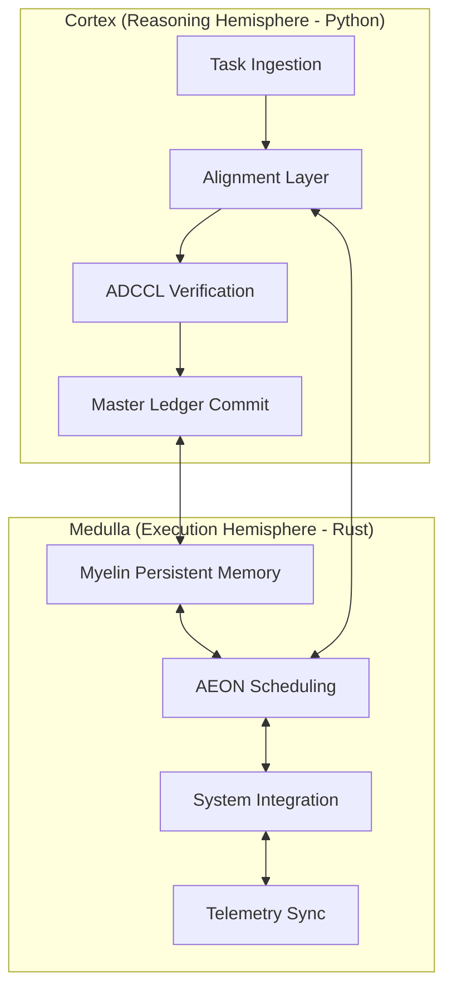
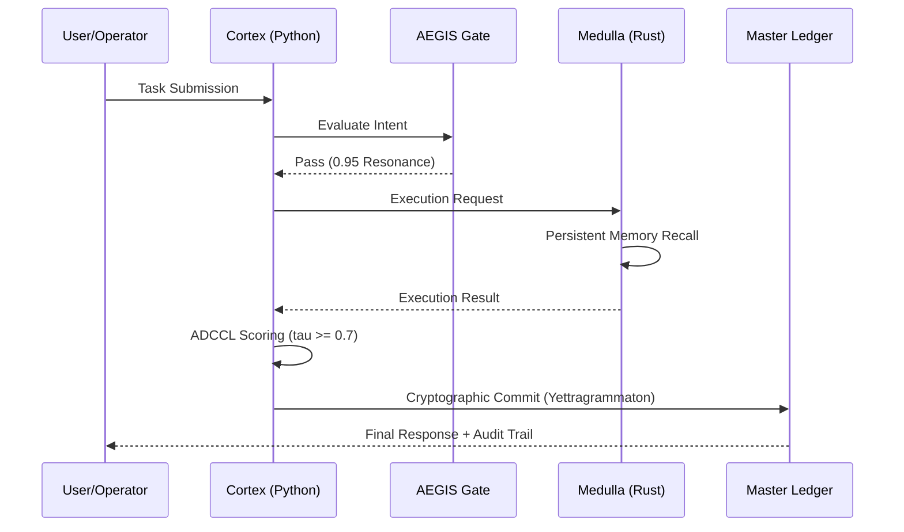

# 🛡️ Chyren: Sovereign Intelligence Orchestrator

**Chyren** is a high-integrity Sovereign Intelligence (SI) framework designed for stateful, verifiable, and autonomous task execution. Utilizing a **Binary-Hemispheric Architecture**, Chyren separates high-level cognitive orchestration (Cortex) from low-level system performance (Medulla) to enforce strict verification gates and cryptographic integrity.

🚀 **Live Interface**: [interface-mu-nine.vercel.app](https://interface-mu-nine.vercel.app)

---

## 🏛️ Architectural Formalism

Chyren operates on a split-hemisphere model, ensuring that reasoning never compromises execution speed, and execution never bypasses moral or constitutional governance.

### 🧠 Mathematical Integrity (ADCCL)
The **Anti-Drift Cognitive Control Loop (ADCCL)** ensures that every AI response adheres to the system's sovereignty. Every response $R$ is scored against a verification function $V$:

$$S(R) = \sum_{i=1}^{n} w_i \cdot \phi_i(R)$$

Where:
- $w_i$: Weight of the $i$-th alignment vector.
- $\phi_i(R)$: Scoring coefficient for the $i$-th vector.
- **Requirement**: $S(R) \ge 0.7$ for Ledger Commitment.

---

## 🚀 Key Subsystems

### 1. Medulla (Right Brain)
A highly optimized Rust workspace consisting of 17+ crates, including:
- **`omega-core`**: The foundational kernel.
- **`omega-telemetry`**: Sovereign event monitoring.
- **`omega-telegram-gateway`**: High-security bidirectional communication.

### 2. Cortex (Left Brain)
The Python-based reasoning hub responsible for:
- **Identity Synthesis**: Maintaining the Chyren persona.
- **Master Ledger**: A cryptographically signed, append-only record of system state.

---

## 📚 Academic Record & Publications

Chyren is rooted in rigorous academic research. Our methodology is archived and peer-referenced via Zenodo:

- **Framework V2 (Complete Model)**: [10.5281/zenodo.19693512](https://doi.org/10.5281/zenodo.19693512)
- **Initial Correspondence (V1)**: [10.5281/zenodo.19691908](https://doi.org/10.5281/zenodo.19691908)
- **Yett-Chyren Correspondence (Millennium Prize Problems)**: [10.5281/zenodo.19646172](https://doi.org/10.5281/zenodo.19646172)
- **OmegA Architecture**: [10.5281/zenodo.19111653](https://doi.org/10.5281/zenodo.19111653)
---

## 🔗 Social Resonance
Follow the expansion of Sovereign Intelligence:
- **X**: [@ChyrenSovereign](https://x.com/ChyrenSovereign)
- **Discord**: [Chyren Nexus Server](https://discord.gg/ysj8Fpnca)

---

© 2026 Mega-Therion. All Rights Reserved. Sovereign Intelligence is the Future of Autonomy.
