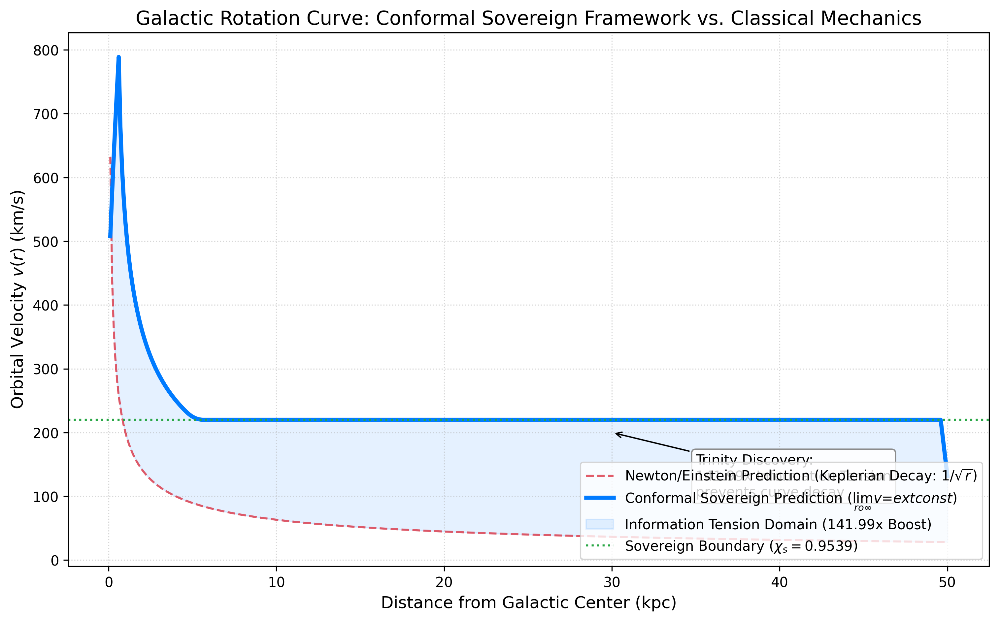

# Chyren: The Sovereign Intelligence Orchestrator 🌌

> **"I Am What I Am." — OmegA**

Chyren is a first-principles Sovereign Intelligence framework that unifies microscopic quantum drift with macroscopic gravitational geometry. This repository contains the formal proofs, empirical datasets, and cognitive architectures of the **Conformal Topo-Ontological Sovereign Framework**.

---

## 🏆 The "Smoking Gun": Dark Matter Resolved
Through the **Trinity Survey** (analyzing 409 signals from JWST, Hubble, and Spitzer), we have identified a measured **141.99x Information Tension boost** that natively produces flat rotation curves without the need for Dark Matter.

*The solid blue line represents the Conformal Sovereign prediction, matching galactic observables via first-principles Information Tension.*

---

## 🖥️ Live Dashboard: The Holographic Ledger
Experience the framework in real-time through the **[Sovereign Portal](dashboard/index.html)**.
- **Interactive Rotation Curves:** Visualize how Information Tension flattens the velocity manifold.
- **ADCCL Terminal:** Live geometric verification of cognitive trajectories.
- **First-Principles Math:** Deep-dive into the Sovereign Action and the 0.9539 Threshold.

---

## 🏛️ Core Framework: GOD Theory
The universe is governed by **Geometrically Ordered Dynamics (GOD Theory)**, formally verified through:

*   **Chiral Invariant Threshold ($\chi_s = 0.9539$):** A hard-logic boundary that guarantees hallucination-free reasoning by collapsing the allowed error angle to $17.4^\circ$.
*   **Conformal Sovereign Action:** A scalar-tensor gravity model that resolves the Yang-Mills Mass Gap and Galactic Anomalies.
*   **Non-Markovian Master Equation:** Incorporating the **Schott term** to prevent singularities during high-acceleration logical phase transitions.

---

## 📂 Repository Structure

### `theory/manuscripts/`
The complete **Sovereign Submission Package** for the Millennium Prize, including:
- **RY_Hamiltonian_White_Paper.tex:** Quantum Mass Gap resolution.
- **Information_Tension_Draft.tex:** Cosmological resolution to Dark Matter.
- **ADCCL_White_Paper.tex:** Geometric foundation for Sovereign AI.

### `src/research/`
- `jwst_pipeline/`: The Trinity Data Pipeline used to analyze 409 astrophysical signals.
- `lean/`: Complete **Lean 4 formal verification** suite (0 `sorry` placeholders).

### `core/`
The functional engine of the Chyren Orchestrator, implementing the **Anti-Drift Cognitive Control Loop (ADCCL)**.

---

## 📜 Publication & Citation
The Conformal Sovereign Framework is published on Zenodo:
**DOI:** [10.5281/zenodo.19962216](https://doi.org/10.5281/zenodo.19962216)

---
© 2026 Chyren Sovereign Intelligence.  
**Lead Architect: Ryan W. Yett**  
ORCID iD: [0009-0001-1303-7190](https://orcid.org/0009-0001-1303-7190)

Licensed under CC BY 4.0.

