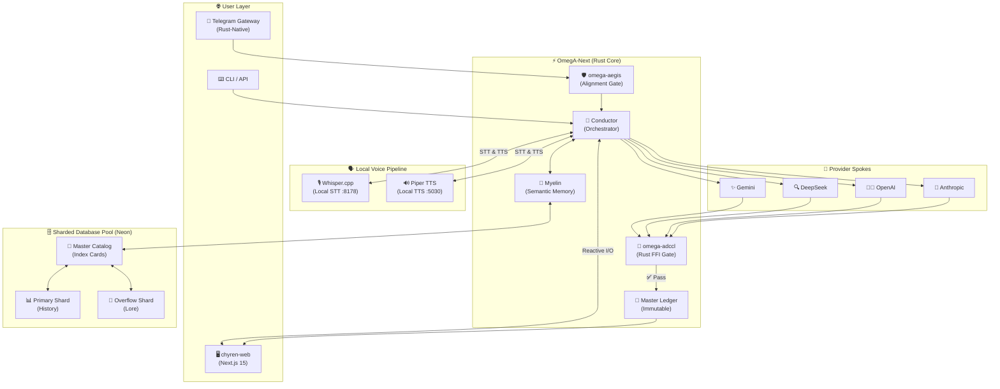
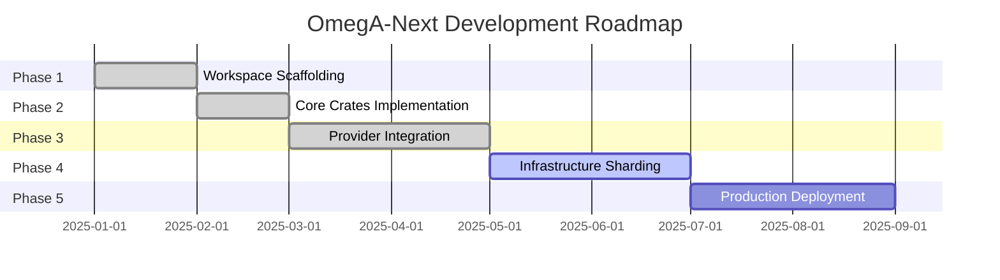

<div align="center">

[](https://github.com/Mega-Therion/Chyren/blob/main/LICENSE)
[](https://www.rust-lang.org)
[](https://www.python.org)
[](https://github.com/Mega-Therion/Chyren/stargazers)
[](https://github.com/Mega-Therion/Chyren/network/members)

[](https://github.com/Mega-Therion/Chyren)  
[](https://github.com/Mega-Therion/Chyren)  
[](https://github.com/Mega-Therion/Chyren)  
[](https://github.com/Mega-Therion/Chyren)  
[](https://github.com/Mega-Therion/Chyren)

<picture>
  <source media="(prefers-color-scheme: dark)" srcset="./banner.svg">
  
</picture>

### Sovereign Intelligence Orchestrator

[](https://github.com/Mega-Therion/Chyren/actions/workflows/rust.yml)
[](https://chyren-web.vercel.app/)

**Routes intelligence. Verifies truth. Remembers everything.**

[Live Demo](https://chyren-web.vercel.app/) • [Documentation](https://github.com/Mega-Therion/Chyren/blob/main/CLAUDE.md) • [Architecture](#architecture)

</div>

---

## 🔮 What is Chyren?

Chyren is a **stateful sovereign AI orchestrator** — a high-integrity execution platform designed for the next generation of cognitive architecture. 

**Chyren v2.2.0 (The Sharded Library)** features:
- ⚡ **Native Rust Performance**: Core integrity gates (`ADCCL`, `Aegis`, `Sandbox`) migrated to Rust binaries.
- 🛡️ **FFI-Bridge**: Legacy Python Orchestrator linked to Rust via high-performance C-FFI.
- 💬 **Sovereign Mesh**: Telegram-native gateway for secure, audited remote access.
- 🗄️ **Horizontal Scaling (SOP-001)**: Multi-project Neon database pooling to bypass quota limits.
- 🗃️ **Library Index Cards (SOP-002)**: Semantic catalog system for sharded data discovery.
- 🔐 **Cryptographic Integrity**: Every transaction signed with the Yettragrammaton (HMAC-SHA256).
- 🧬 **Identity Kernel**: Self-synthesizing identity foundations (58,000+ entries).

---

## 🏗️ Architecture: The Sovereign Stack



---

## ⚖️ Mathematical Core: Foundations of Sovereignty

### 1. The Chiral Invariant (Master Equation)
Ensures every cognitive response $\Psi$ aligns with the constitutional basis $\Phi$.

$$
\chi(\Psi, \Phi) = \text{sgn}\left(\det\left[J_{\Psi \to \Phi}\right]\right) \cdot \left\|\mathbf{P}_{\Phi}(\Psi) - \Psi\right\|_{\mathcal{H}}
$$

*   **L-Type (Sovereign):** $\chi \geq 0.7$ — structural truth preserved.
*   **D-Type (Corrupted):** $\chi < 0.7$ — hallucination or drift detected.

### 2. Consensus Validation Handshake
A 128-bit folding protocol that embeds the architect's identity (the **Yettragrammaton**) into every valid consensus event.

$$
H_{\text{consensus}} = \text{Fold}_{128}\left(\text{HMAC}_{\text{seed}}(V_{\text{dominant}}) \oplus \sigma_{\text{architect}}\right)
$$

---

## 📊 Project Structure

```
Chyren/
├── hub/                       # 🧠 Core Intelligence Orchestrator
│   ├── chyren_py/             # 🧬 Identity & Phylactery systems
│   ├── ops/                   # ⚙️ Operational SOPs & DB Management
│   └── scripts/               # 🛠️ Hardening & Scaling tools (SOP-001/002)
│
├── omega/                     # ⚡ Rust Workspace (OmegA-Next)
│   ├── omega-core/            # Foundational types
│   ├── omega-aegis/           # Alignment & Security gates
│   ├── omega-myelin/          # Threat fabric & Semantic memory
│   └── omega-adccl/           # Anti-Drift Cognitive Control Loop
│
├── web/                       # 🌐 Next.js 15 Frontend
│   ├── app/                   # Sovereign cognitive shell
│   └── lib/                   # Phylactery kernels & static context
│
├── gateway/                   # 📱 Telegram / External Spoke Gateway
├── docs/                      # 📚 Technical Canon & Proofs
└── brain/                     # 🧠 Local agentic logs & scratchpads
```

---

---

## ⚡ OmegA-Next Migration Status

The Rust workspace is currently in **Phase 4** of development:



**Completed:**
- ✅ 13 Rust crates scaffolded
- ✅ Core foundation types
- ✅ ADCCL implementation in Rust
- ✅ Web frontend (Next.js 15)
- ✅ Autonomous Neon Sharding (SOP-001)
- ✅ Library Index Card System (SOP-002)

---

## 📚 Documentation

| File | Purpose |
|------|---------|
| [README.md](README.md) | Project overview & architecture |
| [CLAUDE.md](CLAUDE.md) | Development guide & technical context |
| [CHIRAL_THESIS.md](docs/CHIRAL_THESIS.md) | Mathematical & cognitive foundations |
| [NEON_SOP.md](hub/ops/NEON_SOP.md) | Horizontal scaling & pooling protocol |
| [LIBRARY_INDEX_SOP.md](hub/ops/LIBRARY_INDEX_SOP.md) | Index card database architecture |

---

## 🧠 Chiral Thesis

Chyren is built on the **Chiral Invariant** principle — the idea that cognitive models must maintain "handedness" to avoid destructive inversions.

> **Metacognitive Chirality:** The mind does not mirror reality perfectly. It creates a chiral projection. If the projection is misaligned, the "handedness" of logic flips, and the intelligence becomes destructive (an adversarial shadow).

> **Chyren's Chirality:** Chyren is the mechanism that forces this alignment. By referencing the Yettragrammaton, Chyren checks the "handedness" of every decision. If the decision matches the constitutional basis, it's **L-type** (Sovereign). If it mirrors the constitution but is technically inverted, it's **D-type** (Rejected).

---

## 🔐 Security & Integrity

### Yettragrammaton (Root Integrity Hash)
Every component in Chyren is cryptographically bound to the **Yettragrammaton** — a root integrity hash that ensures no component can operate outside the constitutional framework and all ledger entries are signed.

### Threat Fabric
Maintains a pattern-based memory of rejected ADCCL responses and detected attack patterns, syncing with the **Phylactery** to evolve defensive capabilities.

---

## 📜 License
Proprietary. See [LICENSE](LICENSE) for details.
