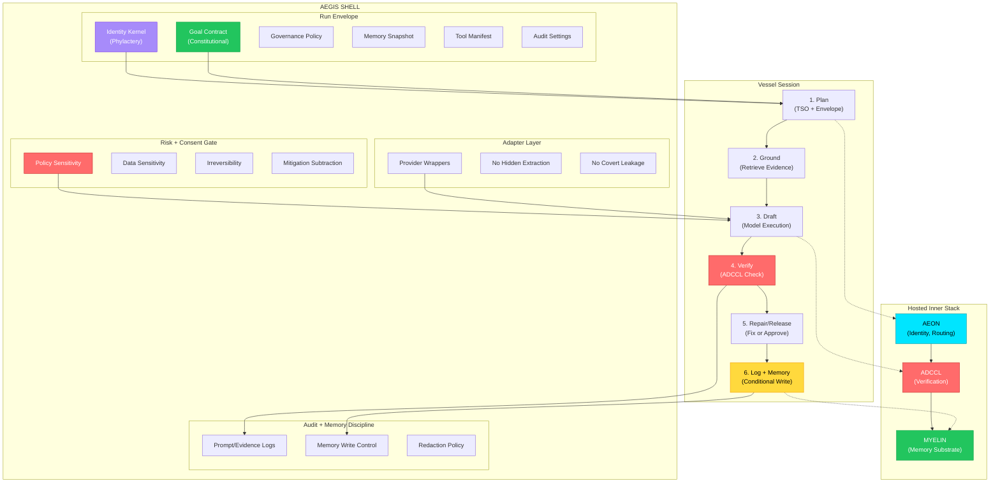

# AEGIS - Theoretical Operating Shell

**Adaptive Envelope for Governance, Identity, and Safety across heterogeneous models**

> "The shell is the locus of sovereignty; the model is a capability substrate."

---

## Overview

AEGIS is a **theoretical framework** for governing AI model execution with strict safety, identity, and audit controls. Chyren implements AEGIS as a practical sovereign intelligence orchestrator.

The AEGIS shell sits *above* the model layer, enforcing:
- Constitutional alignment before execution
- Risk gates and consent management
- Cryptographic audit trails
- Memory discipline and redaction policies

---

## AEGIS Architecture

---

## Chyren Implementation Mapping

### Run Envelope → Chyren Components

| AEGIS Component | Chyren Implementation | File Location |
|----------------|----------------------|---------------|
| Identity Kernel | Phylactery (58K entries) | `chyren_py/phylactery_kernel.json` |
| Goal Contract | Constitutional rules | `state/constitution.json` |
| Governance Policy | Alignment layer | `core/alignment.py` |
| Memory Snapshot | Master Ledger | `core/ledger.py` |
| Tool Manifest | Provider registry | `providers/base.py` |
| Audit Settings | Preflight validation | `core/preflight.py` |

### Risk + Consent Gate → ADCCL

| AEGIS Component | Chyren Implementation | File Location |
|----------------|----------------------|---------------|
| Policy Sensitivity | ADCCL drift score | `core/adccl.py` |
| Data Sensitivity | Threat fabric patterns | `core/threat_fabric.py` |
| Irreversibility | Ledger immutability | `core/ledger.py` |
| Mitigation Subtraction | Risk gate logic | `core/adccl.py` |

### Adapter Layer → Providers

| AEGIS Component | Chyren Implementation | File Location |
|----------------|----------------------|---------------|
| Provider Wrappers | Anthropic, OpenAI, DeepSeek, Gemini | `providers/*.py` |
| No Hidden Extraction | Prompt injection prevention | `providers/base.py` |
| No Covert Leakage | State isolation | `providers/base.py` |

### Vessel Session → Orchestration Loop

| AEGIS Step | Chyren Implementation | Description |
|-----------|----------------------|-------------|
| **1. Plan** | TSO + Envelope decision | Use identity + constitution to decide next step |
| **2. Ground** | Evidence retrieval | Retrieve context from ledger/memory |
| **3. Draft** | Model execution | Route through selected provider spoke |
| **4. Verify** | ADCCL gate | Score ≥0.7 = pass, <0.7 = reject |
| **5. Repair/Release** | Error handling | Fix, downgrade, escalate, or release |
| **6. Log + Memory** | Conditional write | Persist only if policy-approved |

### Hosted Inner Stack → Chyren-Next (Rust)

| AEGIS Layer | Chyren-Next Crates | Status |
|------------|-------------------|--------|
| **AEON** | `chyren-aeon`, `chyren-core` | ✅ Scaffolded |
| **ADCCL** | `chyren-adccl` | ✅ Scaffolded |
| **MYELIN** | `chyren-myelin`, `chyren-dream` | ✅ Scaffolded |

---

## Key Governance Outcomes

AEGIS defines **5 governance outcomes** that Chyren can return:

1. **Permit** — Task approved, execute normally
2. **Verify Further** — Needs additional validation before proceeding
3. **Audit** — Flag for manual review, but allow execution
4. **Escalate** — Requires human intervention
5. **Refuse** — Reject task entirely

**Current Chyren Status:** Implements binary permit/refuse. **Roadmap:** Add graduated outcomes.

---

## AEGIS Annotations

> **Annotation 1:** AEGIS is outermost because it decides what is allowed to run, what gets logged, and what may touch memory or tools.

> **Annotation 2:** The Run Envelope is structural data compiled before the model call. A prompt projection may exist, but it is not the shell itself.

> **Annotation 3:** The adapter layer makes providers swappable without letting the provider redefine identity, policy, or audit doctrine.

> **Annotation 4:** The vessel session is where plan, grounding, drafting, verification, repair, and release happen under shell control.

> **Annotation 5:** Memory writes are conditional. AEGIS governs whether experience, self-tags, or retrieval traces are stored at all.

---

## Why AEGIS Matters for Chyren

AEGIS provides a **theoretical foundation** that validates Chyren's architecture:

- ✅ **Not just a tool** — Chyren is an implementation of a rigorous governance framework
- ✅ **Patent-worthy** — AEGIS + Chyren combination represents novel cognitive control architecture
- ✅ **Production-ready** — The 6-step vessel session is a formal state machine (can be Rust-ified)
- ✅ **Standards-aligned** — AEGIS could become a protocol standard for sovereign AI orchestration

---

## Next Steps

1. **Formalize Vessel Session** — Implement 6-step loop as explicit state machine in `main.py`
2. **Add Governance Outcomes** — Extend ADCCL to return graduated verdicts (not just pass/fail)
3. **Memory Discipline** — Implement conditional write policy in `core/ledger.py`
4. **AEGIS Compliance Audit** — Document full mapping of Chyren → AEGIS spec

---

## References

- Original AEGIS diagram (see `/docs/images/aegis-theoretical-shell.png`)
- [Chyren README](../README.md)
- [Chyren Stack Integration](./CHYREN_STACK.md)
- [Chiral Thesis](../chiral_thesis.md)
