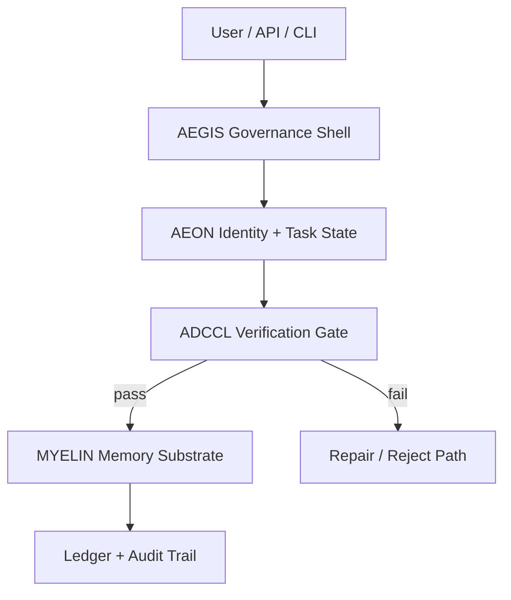
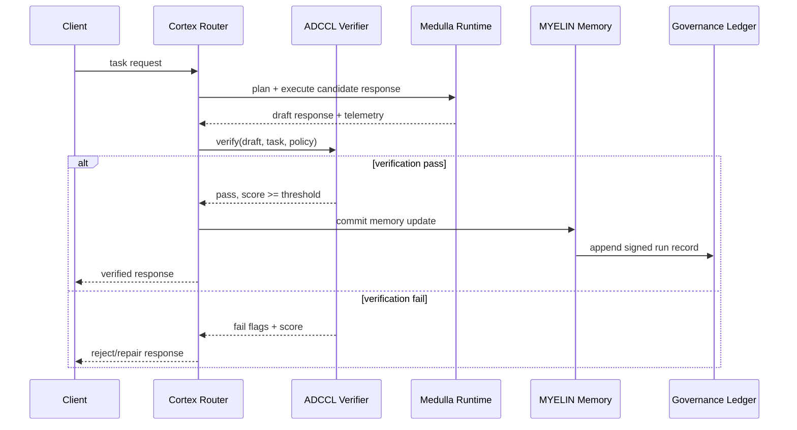
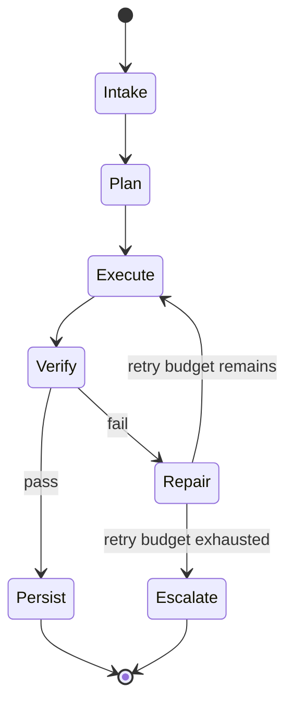

# Architecture Atlas

This atlas is the technical briefing layer for Chyren. It is organized for architecture review, reproducibility checks, and evidence-backed novelty claims.

## 1) System Composition

Rendered reference: 

## 2) End-to-End Control Flow

## 3) Operational State Machine

## 4) Mathematical Guardrail

$$
\chi(\Psi,\Phi)=\operatorname{sgn}(\det[J_{\Psi\to\Phi}])\cdot \|\mathbf{P}_\Phi(\Psi)-\Psi\|_{\mathcal H}
$$

Decision rule in this repo:
- Accept when `chi >= 0.7`
- Reject/repair when `chi < 0.7`

Interpretation:
- Orientation term (`sgn(det(J))`) tracks structural inversion risk.
- Residual term (`||P(Phi)(Psi)-Psi||`) tracks alignment distance from constitutional manifold.

## 5) Evidence Dashboard

Current proof pack: [`docs/evidence/v0.2/`](./evidence/v0.2/README.md)

- 
- 
- 
- 
- 

Latest machine-readable status snapshot:
- [`proof-20260412T003547Z-status.csv`](./evidence/v0.2/raw/proof-20260412T003547Z-status.csv)

## 6) Novelty Matrix (gAIng / Chyren / Chyren)

| Dimension | Conventional Agent Stack | Chyren/Chyren Posture | Evidence Level |
|---|---|---|---|
| Verification timing | Often post-hoc or optional | Mandatory pre-persist gate (`ADCCL`) | Implemented + passing proof-pack gate |
| Runtime topology | Single runtime bias | Deliberate cortex/medulla split (Python+Rust) | Implemented workspace structure |
| Identity governance | Prompt-level only | AEGIS+AEON policy and identity shell | Documented + routed in CLI/system docs |
| Memory writes | Direct write on generation | Write only after verify pass | Implemented flow and ledger semantics |
| Failure handling | Ad-hoc retries | Explicit reject/repair path with flags | Documented and exercised in tests/docs |

## 7) Visual Explainers

- Growth animation: 
- Claim maturity ladder: 
- Extended visual companion: [`SHOWCASE.md`](./SHOWCASE.md)

## 8) Review Checklist

Use this when claiming “novel” or “revolutionary” behavior:
1. Point to a concrete subsystem (`cortex/`, `medulla/`, `web/`, `gateway/`).
2. Link one reproducible command or test.
3. Link one proof-pack artifact (`metrics.csv`, status CSV, or chart).
4. State one boundary condition where behavior can fail.
5. Avoid external-proof language unless third-party replication exists.
