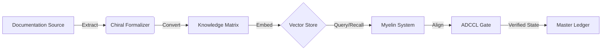

# 🧠 Memory Atlas: Knowledge Ingestion Pipeline

The following diagram illustrates the `knowledge_matrix` vector flow from raw documentation into the semantic memory system.

---
*Generated by Chyren SI Orchestrator.*
