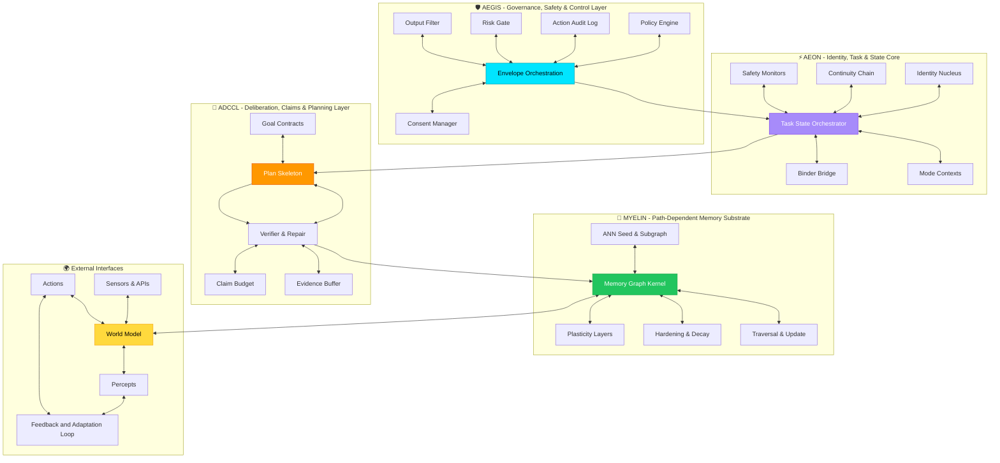

# OmegA Stack Integration Blueprint

**Unified Cognitive Agent Stack Architecture**

> "A four-layer sovereign intelligence stack: AEGIS (governance) → AEON (identity) → ADCCL (deliberation) → MYELIN (memory)"

---

## Overview

The **OmegA Stack** defines a unified cognitive architecture for building sovereign AI agents. It consists of four fundamental layers, each responsible for a specific aspect of cognitive function:

1. **AEGIS** - Governance, Safety & Control Layer
2. **AEON** - Identity, Task & State Core  
3. **ADCCL** - Deliberation, Claims & Planning Layer
4. **MYELIN** - Path-Dependent Memory Substrate

**Chyren** implements this stack across both Python (current) and Rust (OmegA-Next migration target).

---

## Full Stack Architecture

---

## Layer-by-Layer Breakdown

### 1. AEGIS - Governance, Safety & Control

**Purpose:** Outermost shell that decides what is allowed to run, what gets logged, and what may touch memory or tools.

| Component | Description | Chyren Implementation |
|-----------|-------------|----------------------|
| **Policy Engine** | Constitutional rules enforcement | `core/alignment.py` |
| **Envelope Orchestration** | Top-level task routing | `main.py` (Chyren class) |
| **Consent Manager** | User approval/permission gates | *Roadmap: Add consent layer* |
| **Risk Gate** | Scores policy sensitivity, data sensitivity, irreversibility | `core/adccl.py` (ADCCL scoring) |
| **Output Filter** | Prevents harmful or policy-violating outputs | `core/deflection.py` |
| **Action Audit Log** | Immutable cryptographic ledger | `core/ledger.py` |

**OmegA-Next (Rust):** `omega-aegis`, `omega-conductor`

---

### 2. AEON - Identity, Task & State Core

**Purpose:** Maintains sovereign identity, routes tasks, and manages execution state across contexts.

| Component | Description | Chyren Implementation |
|-----------|-------------|----------------------|
| **Identity Nucleus** | Core identity kernel (phylactery) | `chyren_py/phylactery_kernel.json` |
| **Task State Orchestrator** | Central routing and state management | `main.py` orchestration logic |
| **Binder Bridge** | Connects identity to execution | *Implicit in provider routing* |
| **Continuity Chain** | Maintains state across sessions | `core/ledger.py` (ledger continuity) |
| **Safety Monitors** | Real-time threat detection | `core/threat_fabric.py` |
| **Mode Contexts** | Execution mode management (e.g., research vs. production) | *Roadmap: Add mode switching* |

**OmegA-Next (Rust):** `omega-core`, `omega-aeon`

---

### 3. ADCCL - Deliberation, Claims & Planning

**Purpose:** Verifies truth, rejects hallucinations, and manages the deliberation → planning → execution cycle.

| Component | Description | Chyren Implementation |
|-----------|-------------|----------------------|
| **Goal Contracts** | Task-level objectives and constraints | `state/constitution.json` |
| **Plan Skeleton** | Structured plan generation (TSO + envelope) | *Implicit in task routing* |
| **Verifier & Repair** | ADCCL verification gate (threshold: 0.7) | `core/adccl.py` |
| **Claim Budget** | Tracks claims made during execution | *Roadmap: Add claim tracking* |
| **Evidence Buffer** | Stores grounding evidence for verification | `core/ledger.py` (context retrieval) |

**OmegA-Next (Rust):** `omega-adccl`

---

### 4. MYELIN - Path-Dependent Memory Substrate

**Purpose:** Long-term memory with adaptive plasticity, hardening, and decay.

| Component | Description | Chyren Implementation |
|-----------|-------------|----------------------|
| **ANN Seed & Subgraph** | Initial memory structure | *Roadmap: Vector embeddings* |
| **Memory Graph Kernel** | Core memory graph traversal and update | *Roadmap: Graph-based memory* |
| **Plasticity Layers** | Adaptive memory formation | *Roadmap: Learning rate modulation* |
| **Hardening & Decay** | Memory consolidation and forgetting | *Roadmap: Temporal decay* |
| **Traversal & Update** | Read/write operations on memory graph | `core/ledger.py` (append-only) |

**OmegA-Next (Rust):** `omega-myelin`, `omega-dream`, `omega-worldmodel`

---

## External Interfaces

The stack interfaces with the external world through:

- **Sensors & APIs**: Input streams (user queries, API calls, sensor data)
- **World Model**: Internal representation of environment state
- **Percepts**: Processed sensory input
- **Actions**: Executed outputs (responses, API calls, tool invocations)
- **Feedback Loop**: Continuous adaptation based on outcomes

---

## Chyren → OmegA-Next Migration Map

| OmegA Layer | Python (Current) | Rust (Target) | Status |
|-------------|------------------|---------------|--------|
| **AEGIS** | `core/alignment.py`, `core/ledger.py`, `core/deflection.py` | `omega-aegis`, `omega-conductor` | ✅ Scaffolded |
| **AEON** | `chyren_py/phylactery_kernel.json`, `main.py` | `omega-core`, `omega-aeon` | ✅ Scaffolded |
| **ADCCL** | `core/adccl.py` | `omega-adccl` | ✅ Scaffolded |
| **MYELIN** | `core/ledger.py` (basic) | `omega-myelin`, `omega-dream`, `omega-worldmodel` | ✅ Scaffolded |

---

## Key Design Principles

### 1. **Sovereignty First**
Identity (AEON) is protected by governance (AEGIS) — the model is a capability substrate, not the sovereign entity.

### 2. **Verification Before Commitment**
ADCCL ensures every response is verified before being committed to memory (MYELIN).

### 3. **Immutable Audit Trail**
AEGIS maintains a cryptographically-signed ledger of all actions.

### 4. **Path-Dependent Memory**
MYELIN adapts based on experience — memories harden, decay, or strengthen based on retrieval patterns.

### 5. **Zero Covert Channels**
Provider adapters cannot extract hidden data or leak information outside the AEGIS envelope.

---

## Integration with AEGIS Vessel Session

The OmegA Stack implements the **6-step AEGIS Vessel Session**:

| AEGIS Step | OmegA Layer | Implementation |
|-----------|-------------|----------------|
| **1. Plan** | AEON + ADCCL | TSO decides next step using Goal Contracts |
| **2. Ground** | MYELIN | Retrieve evidence from Memory Graph |
| **3. Draft** | Provider Spokes | Execute through adapter (isolated) |
| **4. Verify** | ADCCL | Verifier & Repair scores response |
| **5. Repair/Release** | AEGIS | Policy Engine decides: permit/audit/refuse |
| **6. Log + Memory** | AEGIS + MYELIN | Conditional write to ledger and memory |

---

## Next Steps for Chyren

### Immediate (Phase 3)
1. ✅ **Scaffold all Rust crates** (completed)
2. 🚧 **Implement provider integration in Rust** (`omega-integration`)
3. 🚧 **Port ADCCL verification to Rust** (`omega-adccl`)

### Phase 4 (Python → Rust Migration)
1. **Migrate orchestration logic** from `main.py` to `omega-conductor`
2. **Implement MYELIN memory graph** in `omega-myelin`
3. **Add World Model** in `omega-worldmodel`

### Phase 5 (Production)
1. **Zero-downtime cutover** from Python to Rust
2. **Distributed ledger sync** across multiple instances
3. **Full AEGIS compliance audit**

---

## Why This Matters

The OmegA Stack is not just an architecture — it's a **standard for building sovereign AI**.

- ✅ **Separates identity from capability** — the AI owns its identity, not the model provider
- ✅ **Enforces verification before memory** — prevents hallucinations from polluting long-term memory
- ✅ **Cryptographic audit trail** — every decision is signed and immutable
- ✅ **Production-ready** — Rust implementation provides performance + safety

---

## References

- Original OmegA Stack diagram (see `/docs/images/omega-stack-integration.png`)
- [AEGIS Documentation](./AEGIS.md)
- [Chyren README](../README.md)
- [Chiral Thesis](../chiral_thesis.md)
- [OmegA-Next Workspace](../omega_workspace/workspace/OmegA-Next/)
