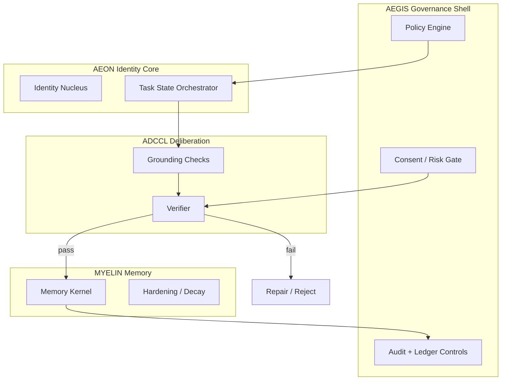
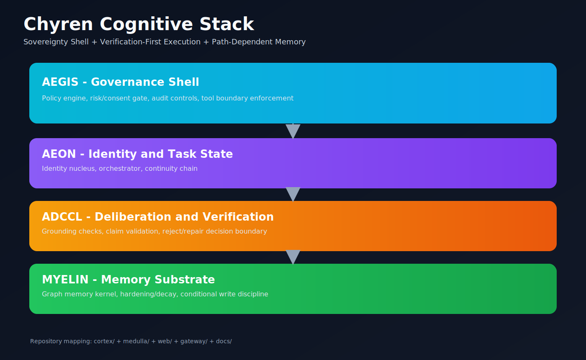
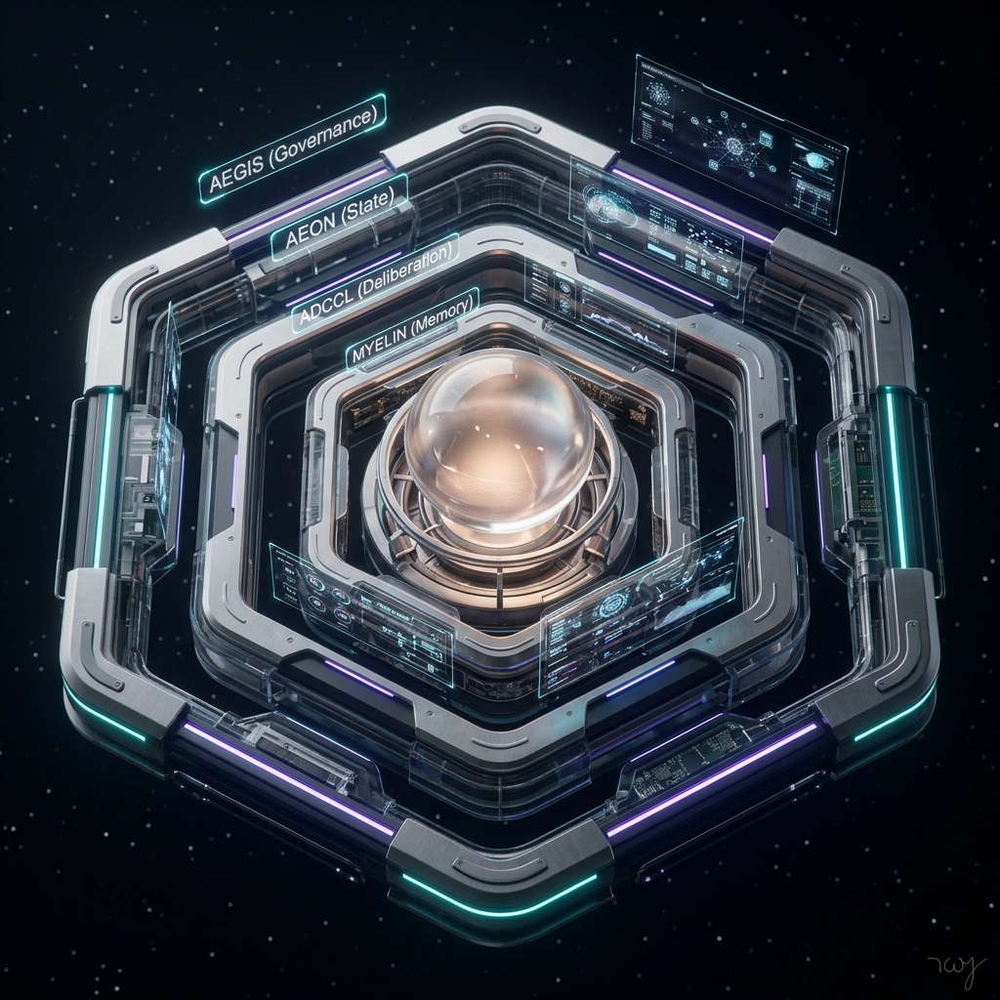
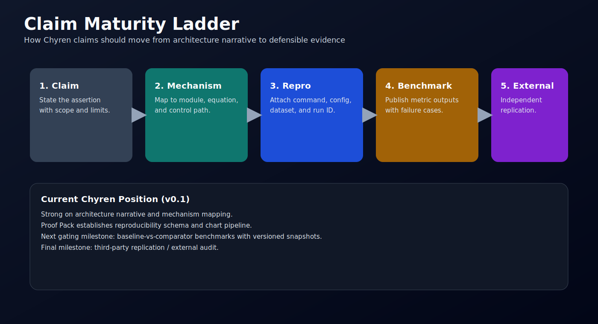
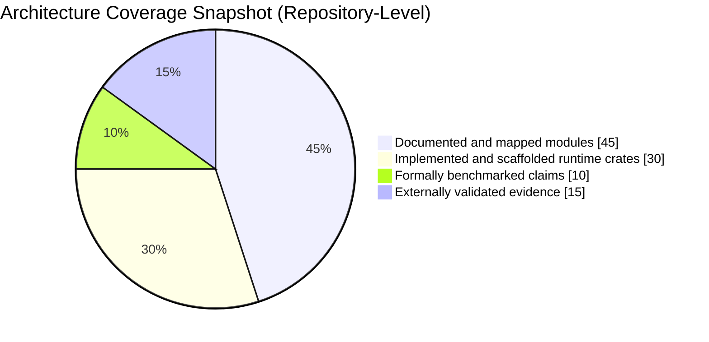
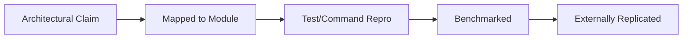

# Chyren Showcase: Architecture, Evidence, and Explainers

This page is the visual and explanatory companion to the main README. It highlights system mechanics, not marketing claims.

Primary architecture dossier: [ARCHITECTURE_ATLAS.md](./ARCHITECTURE_ATLAS.md)
Presentation script: [ARCHITECTURE_DEFENSE_DECK.md](./ARCHITECTURE_DEFENSE_DECK.md)

## 1) System Topology

Rendered export:

## 2) Core Equation
$$
\chi(\Psi,\Phi)=\operatorname{sgn}(\det[J_{\Psi\to\Phi}])\cdot \|\mathbf{P}_\Phi(\Psi)-\Psi\|_{\mathcal H}
$$

Interpretation:
- `sgn(det(J))`: orientation preservation vs inversion.
- `||P(Phi)(Psi)-Psi||`: projection residual (distance from constitutional subspace).
- Operational rule in current docs: accept when `chi >= 0.7`.

## 3) Claim-to-Evidence Pattern
Use this structure in docs and PRs:
1. Claim.
2. Mechanism.
3. Repro command or test path.
4. Observed output.
5. Limits / assumptions.

See [EVIDENCE_MATRIX.md](./EVIDENCE_MATRIX.md) for current status.

## 4) Visual Assets
Animated and static candidate graphics already present in repo:
- Growth GIF: 
- Architecture image: 
- Proof ladder: 

## 5) Progress Snapshot (Chart)

## 6) Claim Maturity Graph

Rendered export:

## 7) Suggested Next Visual Upgrades
- Add one benchmark dashboard image generated from real CI/test artifacts.
- Add a sequence diagram for `plan -> ground -> draft -> verify -> repair/release -> log`.
- Add a versioned “evidence snapshots” folder per release (`docs/evidence/vX.Y/`).
- Add short screencast GIFs for CLI flow (`./chyren status`, `./chyren live`).
