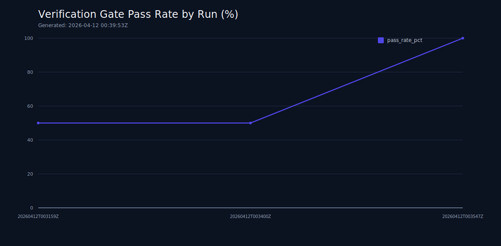
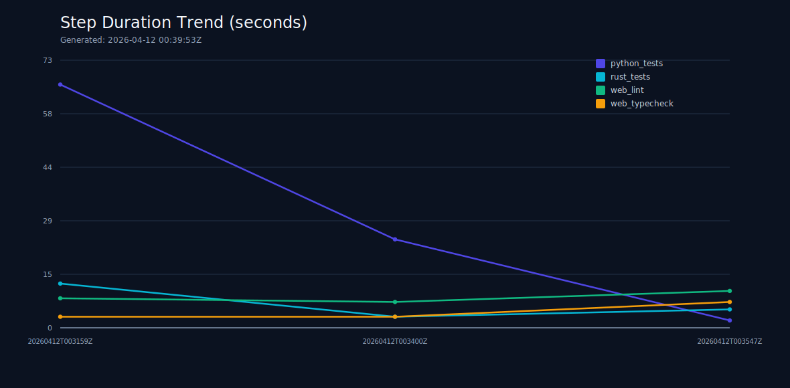
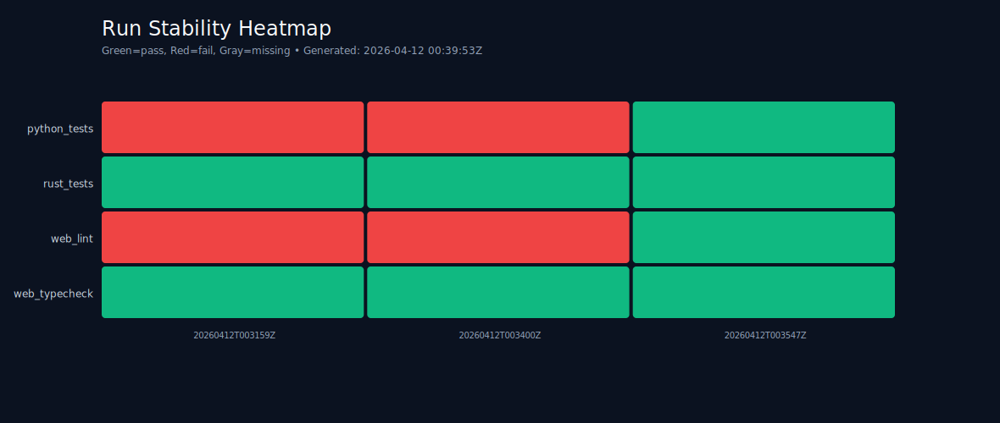
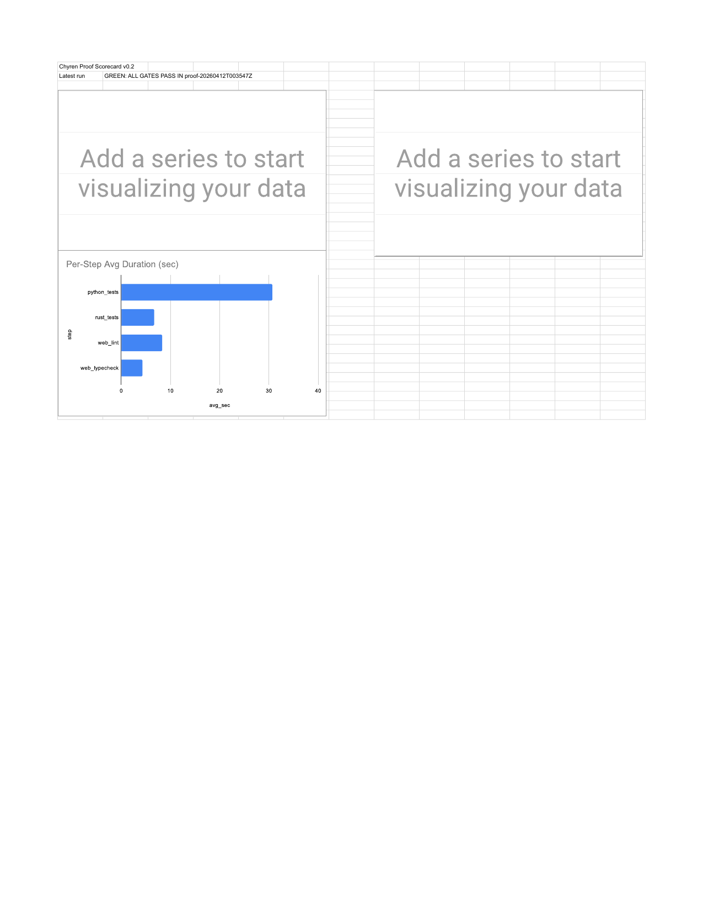
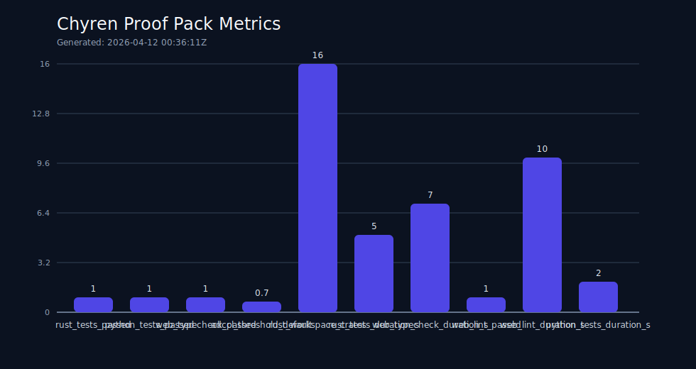
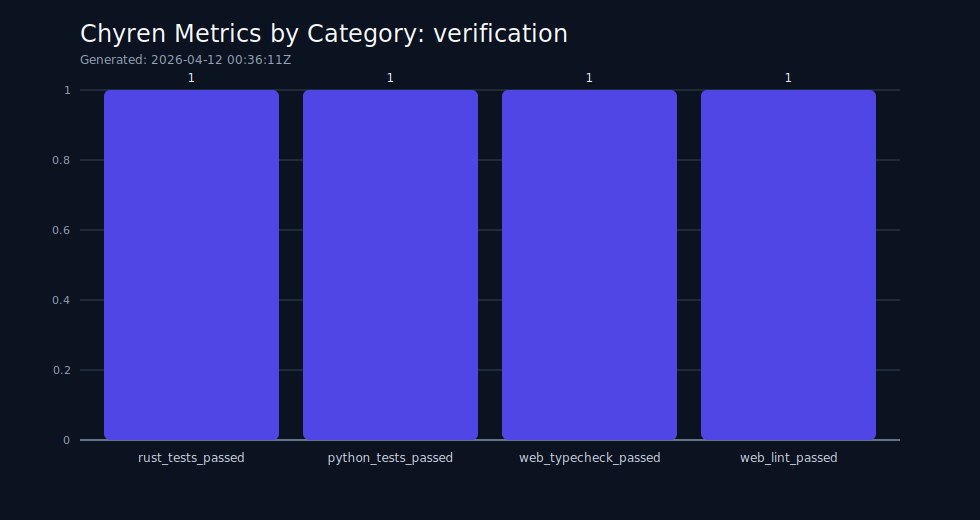
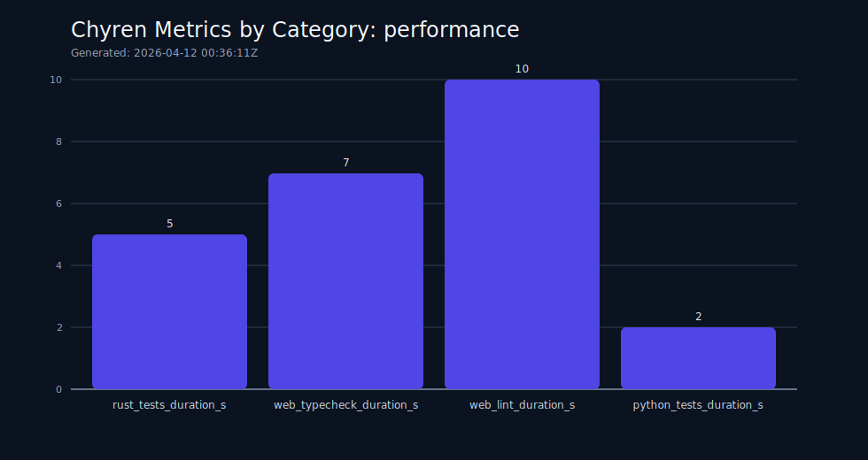

# Proof Pack v0.2 Summary

## Executive Read
- The latest run (`proof-20260412T003547Z`) shows all configured gates passing.
- Prior runs include failure states, which are preserved to demonstrate repair trajectory rather than hidden.
- This pack supports auditability of current claims; it does not yet constitute third-party scientific validation.

## Current Confidence Posture
- **Verification confidence:** high for configured local gates (Rust tests, web typecheck/lint, scoped Python tests).
- **Operational stability:** improving, evidenced by pass-rate trend and stability heatmap.
- **Performance confidence:** moderate; current durations are useful for drift detection but not benchmark-grade capacity claims.

## Trend Artifacts
- 
- 
- 

## Live Scorecard (Google Sheets)
- Dashboard export: 
- Source sheet: https://docs.google.com/spreadsheets/d/1iTKGoVE8VrpPpmeMjDYpQrGErelEitvMl8McnCGjAQ8/edit

## Snapshot Artifacts
- 
- 
- 

## Interpretation Rules
1. Treat pass/fail gates as binary readiness checks, not capability proof.
2. Use trend direction (not single-run values) to discuss reliability.
3. Only claim “demonstrated” when mapped to command + status CSV + chart.
4. Only claim “novel” when architectural difference is explicit and reproducible.
5. Reserve “revolutionary” language for externally replicated evidence.
