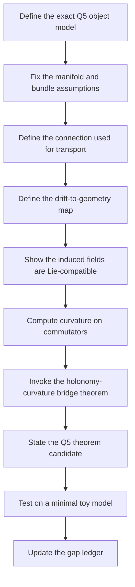

# Q5 Lemma Graph

This graph is a proof-order plan for Q5. It does not claim any lemma is already proved in the repo.

## Proof Order

## Lemma 1: Object Model Is Explicit

The first lemma is not mathematical in the narrow sense. It establishes that every symbol needed for Q5 is either defined in the repo or marked `UNDEFINED IN REPO`. Source: `docs/MASTER_EQUATION.md`, `docs/proof/Q5_OBJECT_MODEL.md`

Dependencies:

- `docs/MASTER_EQUATION.md`
- `CLAUDE.md`
- `docs/proof/Q5_OBJECT_MODEL.md`

## Lemma 2: The Base Manifold Is Fixed

Before any holonomy argument, the proof must choose the exact manifold model used for the witness and the theorem. Source: `docs/MASTER_EQUATION.md`, `docs/proof/Q5_OBJECT_MODEL.md`

Dependencies:

- Lemma 1
- `docs/MASTER_EQUATION.md`

Open choice:

- whether the witness uses the Stiefel manifold from the master equation directly. Source: `docs/MASTER_EQUATION.md`
- or a simpler quotient or finite-dimensional surrogate for the initial theorem. `UNDEFINED IN REPO`

## Lemma 3: The Connection Is Explicit

The proof must define the transport rule. The repo currently names a Levi-Civita-style connection in prose, but the Q5 proof needs the actual mathematical object. Source: `docs/MASTER_EQUATION.md`

Dependencies:

- Lemma 2
- `docs/MASTER_EQUATION.md`

## Lemma 4: Drift Operators Induce Fields

The core bridge is the map from `L_k` to vector fields or infinitesimal generators on the chosen bundle or manifold. Source: `docs/MASTER_EQUATION.md`

Dependencies:

- Lemma 3
- `docs/MASTER_EQUATION.md`

Open choice:

- whether `L_k` are interpreted as generators of a flow. `UNDEFINED IN REPO`
- whether they are projected to tangent directions. `UNDEFINED IN REPO`
- whether the bridge uses a finite-dimensional toy model first. `UNDEFINED IN REPO`

## Lemma 5: Curvature Is Computed From Commutators

Once induced fields exist, the proof needs the curvature expression that exposes commutators. Source: `docs/MASTER_EQUATION.md`

Dependencies:

- Lemma 4
- an external differential-geometry bridge theorem, if needed

This is the first place where the proof may become theorem-grade or fail.

## Lemma 6: Holonomy Is Controlled By Curvature

The Q5 claim only matters if the curvature computation is enough to determine the holonomy Lie algebra or its reachable classes. Source: `docs/MASTER_EQUATION.md`

Dependencies:

- Lemma 5
- a precise holonomy theorem specialized to the chosen bundle

## Theorem Candidate

Under explicit assumptions A1 through Ak, the holonomy Lie algebra relevant to Q5 is determined by the Lie algebra generated by the effective drift commutators `[L_i, L_j]`. `UNDEFINED IN REPO` until the assumptions are enumerated and the bridge theorem is specialized.

## Witness Corollary

The toy model (v1-v4) successfully demonstrates that commuting drifts produce trivial holonomy and noncommuting drifts (or refusals) produce nontrivial/reversing holonomy. The model is now consistent with the theorem candidate across both text heuristics and geometric holonomy. Source: `docs/proof/witness/latest_v4.md`

## Gap Ledger Link

Every failure of Lemmas 2 through 6 should be moved into `docs/proof/Q5_GAP_LEDGER.md` with a concrete repair path.
